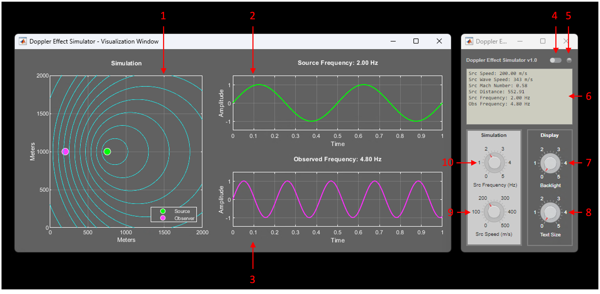

 > ⚠️  Please note that this document is a work in progress and may not include all the required details at this stage.
 
# Doppler Effect Simulator

Doppler Effect Simulator is a simple tool designed to explore and visualize, through a user-friendly interface, the intriguing phenomenon of the Doppler Effect.

<a name="top"/>

## Table of Contents  
* [The Doppler Effect](#the-doppler-effect)  
* [Quickstart Guide](#quickstart-guide)
* [Additional Information](#additional-info)

<a name="the-doppler-effect"/>

## The Doppler Effect [↑](#top)

The Doppler Effect or Doppler Shift is the apparent change in the frequency of a wave (e.g., sound waves or light waves) as perceived by an observer moving relative to the wave source. When the source is moving towards the observer, the wavelengths appear shorter, resulting in a higher perceived pitch for sound waves or a shift towards the blue end of the spectrum for light waves (blueshift). Conversely, when the source is moving away from the observer, the wavelengths appear longer, resulting in a lower perceived pitch for sound waves or a shift towards the red end of the spectrum for light waves (redshift). 

In general, if the speeds of both the source and the observer relative to the medium are lower than the speed of waves in the medium, we can write: 

$$
f =  \left (\frac{c \pm v_o}{c \pm v_s} \right ) \cdot f_0
$$

where:

- $f$ is the observed frequency  
- $f_0$ is the source's emitted frequency  
- $c$ is the propagation speed of the wave in the medium  
- $v_o$ is the speed of the observer relative to the medium  
- $v_s$ is the speed of the source relative to the medium  

Considering an observer stationary relative to the medium ($v_o=0$), we can write:

$$
f =  \left (\frac{c}{c \pm v_s} \right ) \cdot f_0
$$

The latter is the case we are interested in, as it is the one demonstrated in the current version of the simulator.

<a name="quickstart-guide"/>

## Quickstart Guide [↑](#top)  

The picture below shows the simulator GUI.

  

#### 1. Simulation Box

This section is where the simulation happens, it shows the source (green), the observer (magenta), and the wavefronts (cyan).

#### 2. Source Frequency Box 

This section shows a time-domain graph of the emitted wave.

#### 3. Observed Frequency Box 

This section shows a time-domain graph of the observed wave.

#### 4. Color Mode Switch  

You can use this switch to toggle between a dark color scheme and a light one.

#### 5. Status LED
   
   This blinking "LED" shows simulation status:
   - Blinking Green: simulation is working properly.
   - Blinking Red: simulation is too slow, results will be inaccurate.

#### 6. Display 

The display shows the following information:

- Src Speed: it's the speed of the source in meters per second (m/s).
- Src Wave Speed: it's the propagation speed of the emitted wave, which, in our case, is the speed of sound in air at 20 °C (343 m/s).
- Src Mach Number: it's the ratio of the source speed to the wave propagation speed in the medium:
  - < 0.8: the source is moving at subsonic speed.
  - 0.8 - 1.2: the source is moving at transonic speed.
  - 1.2 - 5: the source is moving at supersonic speed.
- Src Distance: it's the distance of the source from the observer in meters.
- Src Frequency: it's the frequency of the emitted wave in Hertz (Hz).
- Obs Frequency: it's the frequency of the observed wave in Hz.

#### 7. Backlight

You can use this knob to control the intensity of the background color of the display.

#### 8. Text Size

You can use this knob to enlarge the text displayed.

#### 9. Source Speed

You can use this knob to select the speed of the source in m/s.

#### 10. Source Emitted Frequency

You can use this knob to select the emitted frequency in Hz.

<a name="additional-info"/>

## Additional Information [↑](#top)  

Please be aware of the following:
- Due to rounding results are approximate.
- Due to timing constraints not every frequency in the knob range is selectable.
- Due to timing constraints knob sensitivity decreases as frequency increases.
- Please wait 3-5 seconds at launch before issuing any command to avoid delayed response from the interface.
